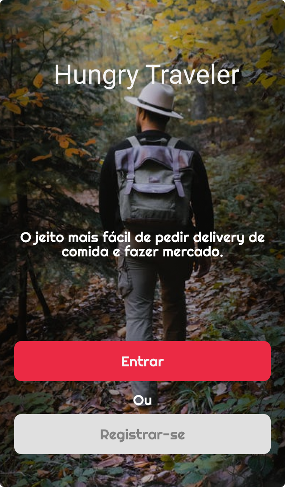
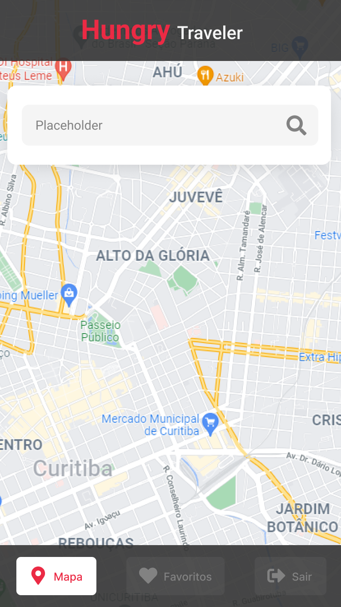
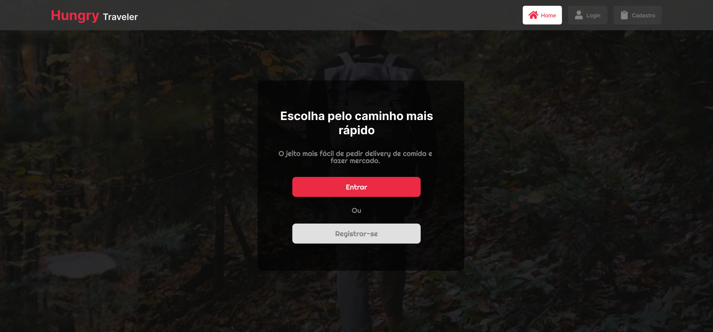
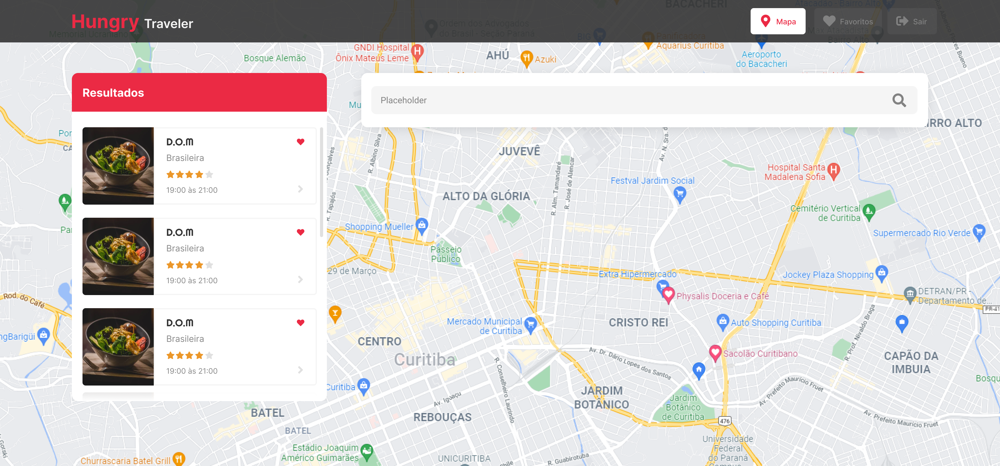

<h1 align="center">
    🍽️ <a href="#" alt="hungry traveler"> Hungry Traveler </a>
</h1>

<h3 align="center">
  🌎 Todos os seus restaurantes favoritos ao redor do mundo em um só lugar! 📱💻
</h3>

<h4 align="center">
	🚧   Concluído 🚀 🚧
</h4>

# Tabela de conteúdos

<!--ts-->

- [Tabela de conteúdos](#tabela-de-conteúdos)
  - [💻 Sobre o projeto](#-sobre-o-projeto)
  - [⚙️ Funcionalidades](#️-funcionalidades)
  - [🎨 Layout](#-layout)
    - [Mobile](#mobile)
    - [Desktop](#desktop)
  - [🛠 Tecnologias](#-tecnologias)
      - [**Website** (React + [TypeScript](https://www.typescriptlang.org/))](#website-react--typescript)
      - [**Utilitários**](#utilitários)
  - [👨‍💻 Contribuidores](#-contribuidores)
  - [🦸 Autor](#-autor)
  <!--te-->

## 💻 Sobre o projeto

🍽️ Hungry Traveler - é uma forma de auxiliar o usuário a se conectar com a gastronomia de um local através de vários restaurantes, conhecendo um pouco mais sobre a história dele e de seus pratos, podendo assim escolher quais restaurantes ele irá visitar, os salvando numa lista de favoritos, e também deixando comentários e uma nota para os restaurantes já visitados, auxiliando assim os outros usuários a escolher os restaurantes que deseja visitar.

Projeto desenvolvido como Capstone do **Q2** do curso desenvolvido pela [Kenzie Academy Brasil](https://kenzie.com.br/v2/).

---

## ⚙️ Funcionalidades

- [x] Os usuários podem se cadastrar na plataforma, onde podem:
  - [x] navegar pelo mapa para ver os restaurantes cadastradas
  - [x] adicionar um restaurante aos seus favoritos
  - [x] entrar na página de um determinado restaurante
  - [x] avaliar um restaurante
  - [x] ver a nota média de um restaurante

---

## 🎨 Layout

O layout da aplicação está disponível no [Figma](https://www.figma.com/file/YvV5NlmCTEXGUUM4IlJbcF/Grupo-1---Capstone-Q2?node-id=483%3A597).

### Mobile

  

  

### Desktop

  

  

---

## 🛠 Tecnologias

As seguintes ferramentas foram usadas na construção do projeto:

#### **Website** ([React](https://reactjs.org/) + [TypeScript](https://www.typescriptlang.org/))

- **[React Router Dom](https://github.com/ReactTraining/react-router/tree/master/packages/react-router-dom)**
- **[React Hook Form & YUP](https://react-hook-form.com/get-started)**
- **[Axios](https://github.com/axios/axios)**
- **[React Toastify](https://www.npmjs.com/package/react-toastify)**
- **[Styled Components](https://react-leaflet.js.org/)**
- **[MUI Components](https://mui.com/pt/)**
- **[React Icons](https://react-icons.github.io/react-icons/)**

#### **Utilitários**

- Protótipo: **[Figma](https://www.figma.com/)** → **[Protótipo (Ecoleta)](https://www.figma.com/file/YvV5NlmCTEXGUUM4IlJbcF/Grupo-1---Capstone-Q2?node-id=2%3A3)**
- API: **[JSON API](https://github.com/hericfelix/hungry-traveler-server)** → **[API Google Maps](https://developers.google.com/maps)**
- Editor: **[Visual Studio Code](https://code.visualstudio.com/)** → Extensions: **[SQLite](https://marketplace.visualstudio.com/items?itemName=alexcvzz.vscode-sqlite)**
- Commit Conventional: **[Commitlint](https://github.com/conventional-changelog/commitlint)**
- Teste de API: **[Insomnia](https://insomnia.rest/)**
- Ícones: **[React Icons](https://react-icons.github.io/react-icons/)**

---

## 👨‍💻 Contribuidores

💜 Team Hungry Traveler 👏👏👏👏

<table>
  <tr>
    <td align="center"><a href="https://www.linkedin.com/in/hericfelix/"> <b>Heric Félix</b></a> <a href="https://www.linkedin.com/in/hericfelix/" title="Linkedin">🔗</a></td>
    <td align="center"><a href="https://www.linkedin.com/in/lucasgasque/"> <b>Lucas Gasque</b></a> <a href="https://www.linkedin.com/in/lucasgasque/" title="Linkedin">🔗</a></td>
    <td align="center"><a href="https://www.linkedin.com/in/pedro-kopsch/"> <b>Pedro Kopsch</b></a> <a href="https://www.linkedin.com/in/pedro-kopsch//" title="Linkedin">🔗</a></td>
    <td align="center"><a href="https://www.linkedin.com/in/tulio-goulart-pereira/"> <b>Tulio Goulart</b></a> <a href="https://www.linkedin.com/in/tulio-goulart-pereira//" title="Linkedin">🔗</a></td>
  </tr>
</table>

## 🦸 Autor

💜 Team Hungry Traveler 👏

---
